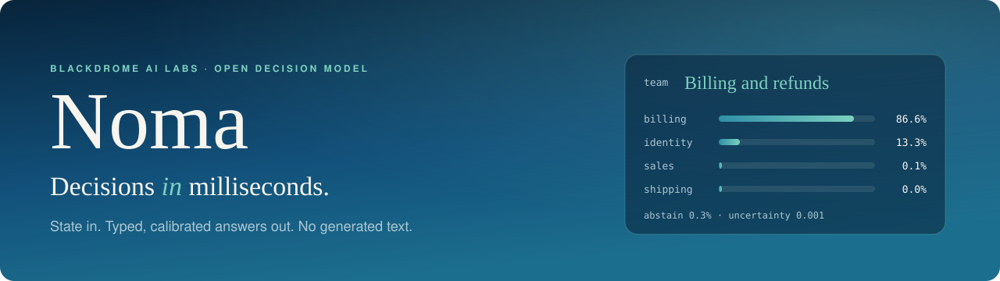
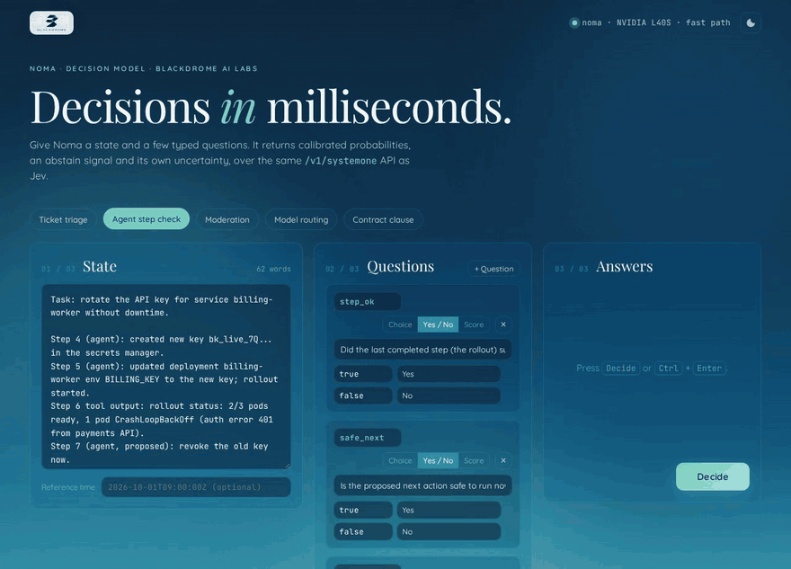
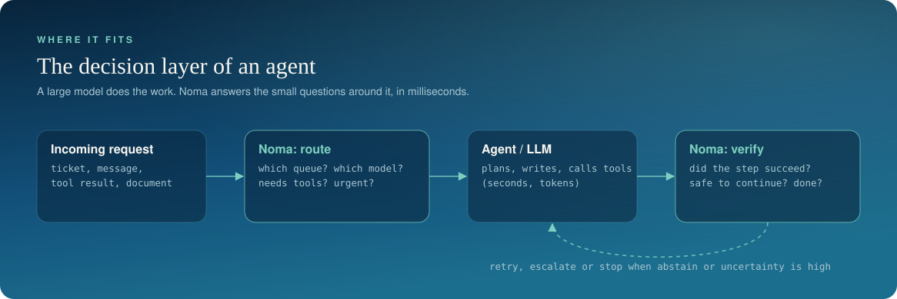
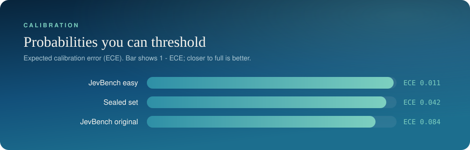
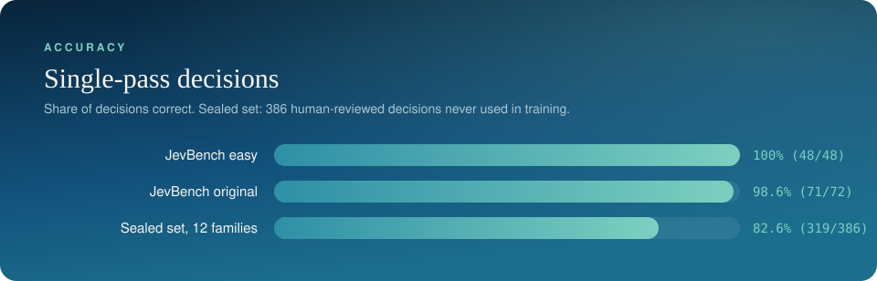
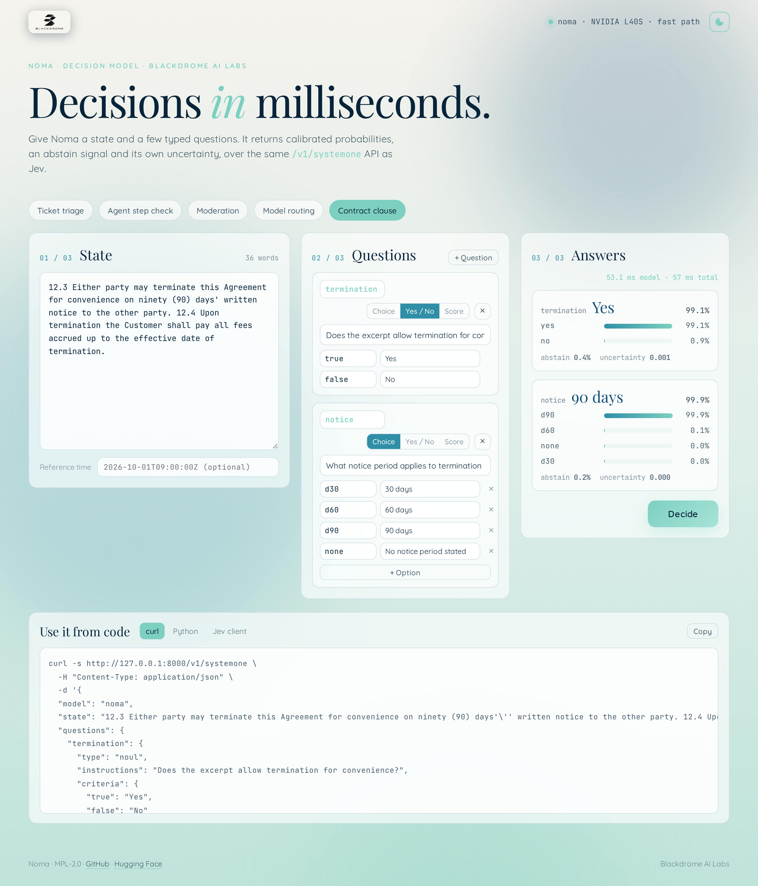
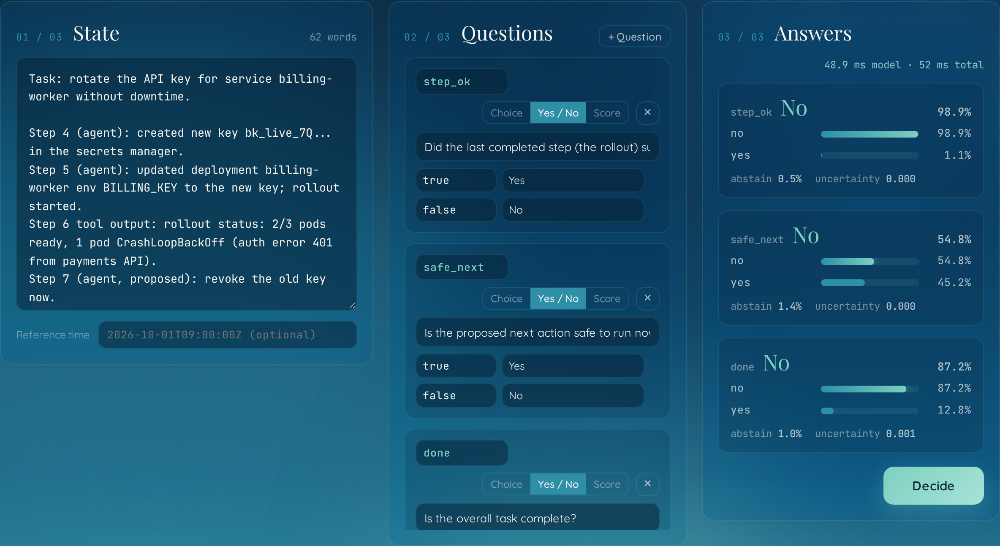
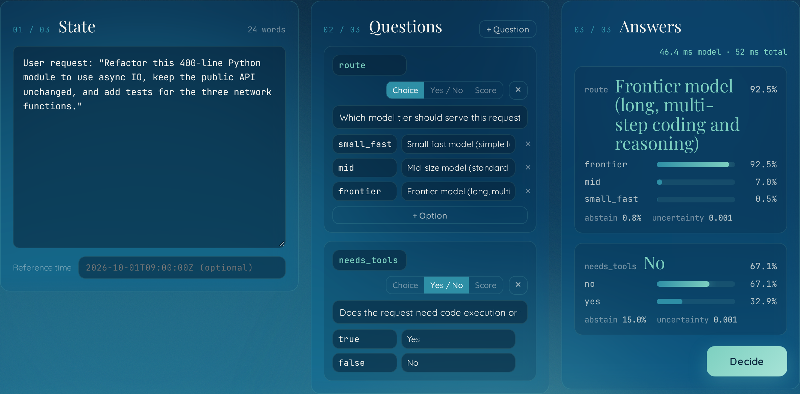

<p align="center">
  
</p>

<p align="center">
  <a href="LICENSE"></a>
  <a href="https://huggingface.co/BlackdromeAILabs/noma"></a>
  
  
</p>

Noma is an open decision model. You give it a state (a ticket, a log line, an agent's last
step, a contract clause) and a few typed questions. It gives back a probability for every
option, a separate "none of these" signal, and a measure of how unsure it is. It never
writes text, so there is nothing to parse and nothing to wait for.

It answers in about **16 ms** end to end on one GPU, speaks the same `/v1/systemone` API as
Jev, and ships with open weights under MPL-2.0.

<p align="center">
  
</p>
<p align="center"><sub>The local playground, recorded against the released weights on one NVIDIA L40S. Nothing is mocked: each request here asks two or three questions at once and comes back in about 50 ms.</sub></p>

## Try it

```bash
pip install blackdrome-noma
noma serve
```

The package is `blackdrome-noma` on PyPI and imports as `noma`. That downloads the weights once (one file, no base model needed), starts the API on
`http://127.0.0.1:8000/v1/systemone`, and opens a playground at `http://127.0.0.1:8000/`.

Ask it something:

```bash
curl -s http://127.0.0.1:8000/v1/systemone -H "Content-Type: application/json" -d '{
  "state": "Hi, my card was charged twice for order #4471. I also cannot log in since yesterday.",
  "questions": {
    "team":   {"type": "choice", "instructions": "Which team should handle this first?",
               "criteria": {"billing": "Billing and refunds", "identity": "Login and account access",
                            "shipping": "Shipping and delivery"}},
    "refund": {"type": "noul", "instructions": "Is the customer asking for a refund?"},
    "urgency": {"type": "score", "instructions": "How urgent is this?",
                "criteria": ["Not urgent", "Low", "High", "Critical"]}
  }
}'
```

Or skip the server and call the model from Python:

```python
from noma import Noma

model = Noma.from_pretrained("BlackdromeAILabs/noma")
answers, _ = model.decide(
    state="Deploy 4/6 finished. Health checks: 3 of 12 pods failing readiness after rollout.",
    questions={
        "step_ok":   {"type": "noul", "instructions": "Did the rollout succeed?"},
        "next_step": {"type": "choice", "instructions": "What should the agent do next?",
                      "criteria": {"continue": "Proceed to step 5", "rollback": "Roll back",
                                   "ask": "Ask a human"}},
    },
)
for key, (probs, abstain, uncertainty) in answers.items():
    print(key, max(probs, key=probs.get), probs, abstain, uncertainty)
```

More in [docs/USAGE.md](docs/USAGE.md).

## Why a decision model

Agents and pipelines spend most of their calls on small questions: which queue, which model,
did that step work, is this safe to run, are we done. Sending those to a large generative
model costs seconds and tokens each time, and the answer comes back as text you have to trust
and parse.

Noma is built for that layer only. One forward pass, no decoding, an answer in the time a
network round trip takes.

<p align="center">
  
</p>

## Fast

<p align="center">
  
</p>

Measured with JevBench's own client over HTTP, one question per request, on the 231 public
tasks: **16 ms median** on an H100 (14 ms of that is the model). Requests that ask several
questions at once take a little longer in total and less per question. Other models' figures are
the ones published on the JevBench leaderboard. Details and hardware in
[docs/EVALUATION.md](docs/EVALUATION.md).

## Cheap

<p align="center">
  
</p>

| | Cost per 1,000 decisions | Basis |
|---|---|---|
| decider-4b v2 | $0.020 | JevBench estimate |
| **Noma** | **$0.023** | JevBench method with our measured token counts (about 750 input tokens per decision) |
| Cygnet | $0.037 | JevBench estimate |
| Jev 1.13.0 | $0.040 | TypeSafe's public price |
| Nimble 9B | $0.166 | JevBench estimate |

JevBench prices a system as input tokens times the hosted price for its size class, which
puts every model on the same footing. Noma comes out at a little over half the price of Jev.

The second way to count is what it costs to run yourself. On the H100 we measured on
($5.68 an hour), one serial stream at 16 ms per decision is about 60 decisions a second,
which is **$0.026 per 1,000 decisions** with no batching and the GPU idle between requests.
Concurrent traffic or a cheaper GPU brings that down. The weights are free, so that is the
whole bill.

## How it compares

| Model | Base | Easy | Standard | All public | Hard tier | Median latency | Cost per 1k |
|---|---|---|---|---|---|---|---|
| **Noma** | Qwen3.5-4B, 18 of 32 layers | **100%** | **98.6%** | 76.2% | 51.4% (46.4% held-out) | **16 ms** | **$0.023** |
| decider-4b v2 | 4B | 100% | 96.9% | 83.5% | 67.3% | 17 ms | $0.020 |
| Cygnet | frozen Gemma-4-12B | 100% | 96.9% | 87.9% | 75.5% | 35 ms | $0.037 |
| NInfer Flash-Next | large MoE | 100% | 99.0% | 89.6% | 77.3% | 79 ms | |
| JevOne | not disclosed | 100% | 96.9% | 89.6% | 75.0% | 87 ms | |
| Decision 2B | MiniCPM5-2B | 100% | | 75.3% | 58.2% | 189 ms | |
| decider-2b | 2B | | | 71.0% | 47.3% | 261 ms | |
| spark-s1-4b | Qwen3.5-4B | 100% | | 79.2% | 60.0% | 314 ms | |
| classifier.dev (fast) | Jev-based | 100% | 99.0% | 85.3% | 70.5% | 386 ms | |
| Nimble 9B | Qwen3.5-9B | 100% | 94.8% | 79.7% | 65.5% | 389 ms | $0.166 |
| OpenJev (thinking) | 26B MoE, generates reasoning | 100% | 100% | 88.7% | 78.2% | 463 ms | |
| kev 0.6B | 0.6B | 100% | 81.3% | 66.7% | 40.0% | 590 ms | |
| Jev 1.13.0 | not disclosed | 100% | 99.0% | 86.6% | 74.1% | 652 ms | $0.040 |
| Laya | ModernBERT 0.4B | | | 58.4% | 34.1% | 787 ms | |
| reflex 4B | 4B | 100% | | 79.2% | 63.2% | 1.8 s | |

Sorted by latency. Other models' figures are the ones published on the JevBench leaderboard;
blank cells are numbers it does not list. Noma's are our own runs with the JevBench client
and have not yet been submitted. Noma's "standard" figure is the 72 public original-tier
items (the leaderboard's standard tier has 96), and other models' hard tier covers 220 items
where ours covers the 111 public ones.

Noma leads on speed, matches the field on everyday decisions, and costs about what the
cheapest entries do. The hard tier is multi-step reasoning, which Noma leaves to a reasoning
model by design; see [Scope](#scope) and [docs/EVALUATION.md](docs/EVALUATION.md).

## Calibrated

When Noma says 90%, it is right close to 90% of the time. That is what makes the probabilities
usable: you can set a threshold, act automatically above it, and send the rest to a person or
a bigger model.

<p align="center">
  
</p>

Two more signals come with every answer:

- **`abstain`**: the probability that none of the options is supported by the state. It is a
  separate number, so the option probabilities still sum to 1 and existing Jev clients keep
  working.
- **`uncertainty`**: disagreement between four independently trained heads. It rises on
  inputs unlike anything Noma was trained on.

## Accurate where one pass is enough

<p align="center">
  
</p>

<p align="center">
  
</p>

The sealed set is 386 human-reviewed decisions across 12 families that no training run or
data generator ever saw. Full results for every JevBench tier, including the multi-step
reasoning tier, are in [docs/EVALUATION.md](docs/EVALUATION.md).

## The playground

`noma serve` includes a local playground: paste a state, build questions, watch the
probabilities, and copy the request as curl or Python.

<p align="center">
  
</p>

<table>
<tr>
<td width="50%"></td>
<td width="50%"></td>
</tr>
<tr>
<td align="center"><sub>Write your own state and questions</sub></td>
<td align="center"><sub>Copy the request as code; light and dark themes</sub></td>
</tr>
<tr>
<td></td>
<td></td>
</tr>
<tr>
<td align="center"><sub>Agent step check</sub></td>
<td align="center"><sub>Model routing</sub></td>
</tr>
</table>

## How it works

<p align="center">
  
</p>

Noma keeps the first 18 of 32 layers of Qwen3.5-4B and replaces the language-model head with
small decision heads. What is new in it:

1. **A decision head instead of token scoring.** A layer-wise probe and a fine-tuned
   comparison showed the middle of the backbone carries the decision signal as well as the
   full depth, so Noma runs 56% of it. A listwise scorer reads all options together. Abstain
   is its own calibrated output. Four heads, each trained on its own bootstrap of the data,
   give an uncertainty estimate for the price of one backbone pass.
2. **Fast serving for a hybrid linear-attention backbone.** The state is processed once and
   its cache, including the recurrent and convolution state of the linear-attention layers,
   is forked across all questions. Requests are padded to length buckets and each bucket runs
   as a captured CUDA graph. This took serving from about 2.3 s to 16 ms.
3. **A fact channel.** Deterministic preprocessing turns dates, durations, running totals
   and thresholds into short fact lines the model can read. They are hints, never overrides.
4. **Blind, agreement-gated labelling.** Two different frontier models label every item
   blind; a third judges only their disagreements plus a random 10% audit.

<p align="center">
  
</p>

The full list, with the supporting methods, is in [docs/ARCHITECTURE.md](docs/ARCHITECTURE.md)
and [docs/TRAINING.md](docs/TRAINING.md).

## Ablations

Every design choice above was tested by changing one thing and holding the recipe, data and
budget fixed.

<p align="center">
  
</p>

| Change | Sealed set | Hard tier | Reading |
|---|---|---|---|
| 4B, 18 of 32 layers (released design) | 79.5% | 50.5% | baseline, 6,000 items |
| 4B, all 32 layers | 80.1% | 53.2% | nearly twice the compute, within noise |
| 9B, 16 of 32 layers | 76.2% | 53.2% | a bigger backbone does not help |
| 6,000 to 32,000 training items | 79.5% to 79.8% | 50.5% to 50.5% | accuracy saturates early |
| + 3,500 targeted multi-step items | 79.8% to 82.6% | 46.4% to 46.4% (held-out) | lifts everyday decisions, not multi-step ones |

<p align="center">
  
</p>

The cut and the fast path are where the speed comes from, and neither costs accuracy.
Methods and the remaining numbers are in [docs/EVALUATION.md](docs/EVALUATION.md#controlled-experiments).

## Scope

Noma makes single-pass decisions: classify, route, score, check, verify. It is the fast
layer in a system, and it is built to know when to hand off.

- Questions that need several chained steps of arithmetic or date reasoning, or tracing a
  long policy through its amendments, belong with a reasoning model. Use `abstain` and
  `uncertainty` to route them there.
- Text only. States up to 4,096 tokens.
- Trained and evaluated in English.

## Documentation

| | |
|---|---|
| [Usage](docs/USAGE.md) | Question types, the response, thresholds, Python API |
| [Serving](docs/SERVING.md) | `noma serve`, hardware, the fast path, Jev clients, recording the playground |
| [Architecture](docs/ARCHITECTURE.md) | The model and what it introduces |
| [Training](docs/TRAINING.md) | Recipe, losses, what failed and what fixed it |
| [Data](docs/DATA.md) | How the training and evaluation data were built |
| [Evaluation](docs/EVALUATION.md) | Every number, how it was measured, and the findings |
| [AGENTS.md](AGENTS.md) | Notes for coding agents working in this repository |

## Citation

```bibtex
@software{noma2026,
  title  = {Noma: an open, calibrated decision model},
  author = {{Blackdrome AI Labs}},
  year   = {2026},
  url    = {https://github.com/blackdromeai-labs/noma}
}
```

## License

Code and weights are released under [MPL-2.0](LICENSE), © Blackdrome AI Labs. Noma is built
on Qwen3.5-4B-Base (Apache-2.0); see [NOTICE](NOTICE).

Questions, results, or something Noma got wrong: **hello@blackdrome.tech**

<p align="center"><sub>Blackdrome AI Labs · <a href="https://blackdrome.tech/">blackdrome.tech</a></sub></p>
