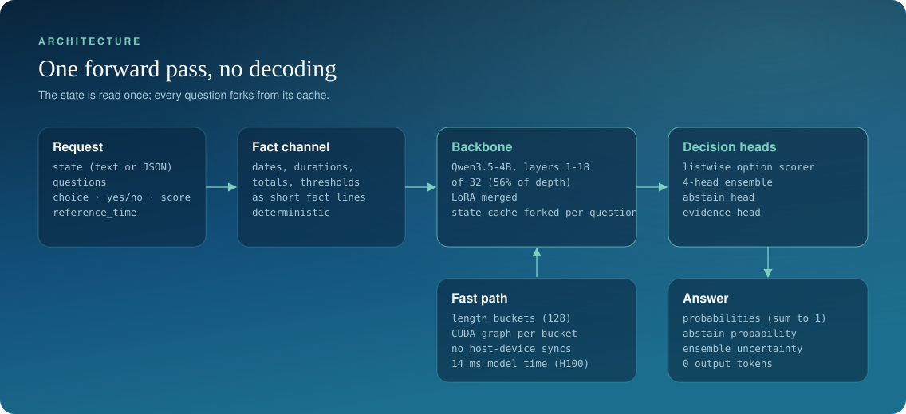
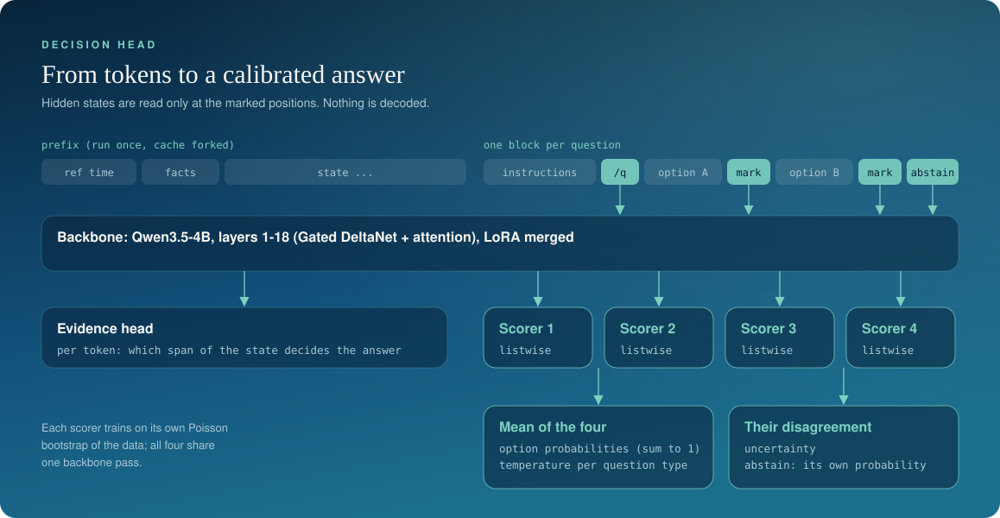

# Architecture

Noma reads a state and a set of typed questions and returns a probability for every option.
It has four parts: a serialiser with a fact channel, a cut backbone, decision heads, and a
serving path built around the backbone's cache.

## Input

A request is serialised as a **prefix** (the state, then computed fact lines; the reference
time is the first fact line) followed by one **block** per question (instructions, then each
option followed by a marker token, then an abstain marker and an end token).
Nine special tokens mark these boundaries. They get their own small trained embedding table;
the backbone's 250k-row embedding matrix stays frozen and untouched.

### Fact channel

Language models are unreliable at date arithmetic and running totals, and a single-pass
model has no scratchpad to work them out. Before the model reads the state, a deterministic
preprocessor writes short fact lines after it:

- relative dates resolved against `reference_time` ("3 days ago" becomes a date);
- elapsed real hours between timestamps, correct across daylight-saving changes;
- inclusive day counts between dates;
- running totals in document order, and where a total crosses a threshold named in the text;
- rule amounts set against ledger amounts, and percent-of-amount;
- binary and decimal data unit conversions.

The facts are hints. They are added to the input, never forced on the output, and the model
is trained with them present so it learns when they matter. The channel is versioned
(`facts-0.2` in the released weights) because changing it changes the model's inputs.

## Backbone

Noma uses the first **18 of 32 layers** of Qwen3.5-4B-Base, a hybrid of Gated DeltaNet
(linear attention) and full attention layers, adapted with LoRA (rank 16). In the released
weights the adapter is merged, so there is one set of weights and no adapter library at
inference.

Why stop at layer 18: a layer-wise probe with a frozen backbone, followed by a fine-tuned
comparison under an identical recipe, showed that the middle of the network carries the
decision signal as well as the full depth does. In the paper, three seeds give 79.4% on the
sealed set at both 18 and 32 layers. The cut removes 44% of the layers; most of the latency
reduction comes from the serving path. One earlier run with a 9B backbone scored no better
than the 4B one (one seed, earlier data build). Numbers are in
[EVALUATION.md](EVALUATION.md#controlled-experiments).

## Decision heads

The language-model head is removed. In its place:

**Listwise option scorer.** For each question the hidden states at the question's end token
and at each option's marker are gathered and passed to a small bidirectional transformer
(2 layers, width 512). It sees all options at once and scores them against each other. In the paper's ablations a
simpler head that scores each option on its own did as well. `score` questions add an ordinal embedding so the scorer
knows the levels are ordered.

**Separate abstain output.** An extra slot stands for "none of these is supported by the
state". It has its own output and its own calibration, and it is reported next to the option
distribution instead of inside it. The option probabilities therefore always sum to 1, which
is what Jev clients expect.

**Ensemble uncertainty.** There are four scorers on one shared backbone. Each trains on its
own resample of the data (an online Poisson bootstrap: every item gets a Poisson(1) weight
per head, fixed by a hash). Their mean is the answer; their disagreement is `uncertainty`.
The backbone runs once, so the ensemble costs almost nothing at inference. The paper's
ablations found that the bootstrap makes no measurable difference and that one head is as
accurate as four; disagreement is a weaker error signal than confidence.

**Evidence head.** A linear head over the state tokens is trained to mark the span that
decides the answer. Labellers' supporting quotes become per-token targets. It is an auxiliary training signal;
its effect was not ablated.

**Calibration.** After training, one temperature per question type and one for abstain are
fitted on a held-out calibration split.

## Serving path

**Prefix fork.** Used for requests with more than two questions on a long state (a prefix
over 1,024 tokens). The state is processed once. Its key-value cache is then expanded across
all question blocks, which run as one batch. For this backbone the cache is more than
attention keys and values: the linear-attention layers carry recurrent state and a
convolution state, and both are forked too. The result matches running each
`[prefix + question]` separately to about 1e-6 in fp32.

**Length buckets and CUDA graphs.** Single-question requests are padded to multiples of 128 tokens and each
bucket shape is captured as a CUDA graph at start-up. Capture requires a forward pass with
no host-device synchronisation, so the embedding lookup for the new tokens is branch-free
and the backbone's attention mask builder is bypassed. This took one decision from about 2.3 s (an early development figure) to 14 ms of model
time on an H100.

## How Noma is built

The paper measures which of these parts matter. Cutting to 18 layers costs no accuracy, and the abstain output needs its own supervision. The listwise head, the four-head ensemble, the fact channel and the extra loss terms showed no measurable benefit over simpler choices.

The main parts:

1. A decision head on a measured mid-depth cut: listwise scoring, abstain as its own
   calibrated output, and bootstrap-ensemble uncertainty on a shared backbone.
2. Fast serving for a hybrid linear-attention backbone: prefix fork including recurrent and
   convolution state, length buckets, and per-bucket CUDA graphs.
3. The fact channel.
4. An agreement-gated, blind labelling cascade (see [DATA.md](DATA.md)).

Supporting methods: contrastive groups (one document, several questions, each with an edit
of at most 8 words that flips its answer); soft labels; a calibration-first objective; the
evidence head; exact-label code generators (see [TRAINING.md](TRAINING.md) and
[DATA.md](DATA.md)).

## Files

| Path | What is in it |
|---|---|
| `noma/model/noma.py` | The model: backbone cut, new-token embeddings, `decide`, fast path |
| `noma/model/heads.py` | Listwise and pointwise scorers, ensemble, evidence head |
| `noma/model/serialize.py` | Prefix and block serialisation, special tokens |
| `noma/model/facts.py` | The fact channel |
| `noma/export.py` | Single-file export and `from_pretrained` |
| `noma/serve/app.py` | The HTTP server and playground |
| `noma/train/` | Trainer, losses, encoding cache |
