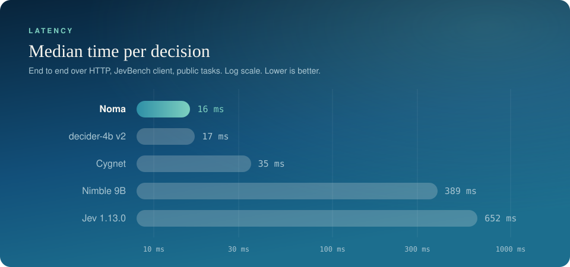
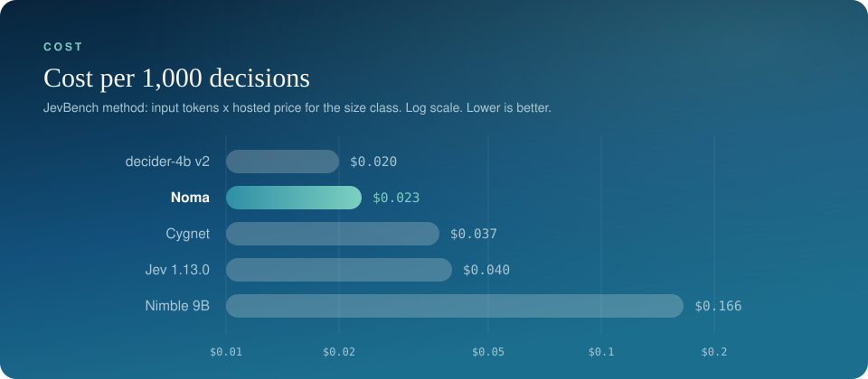
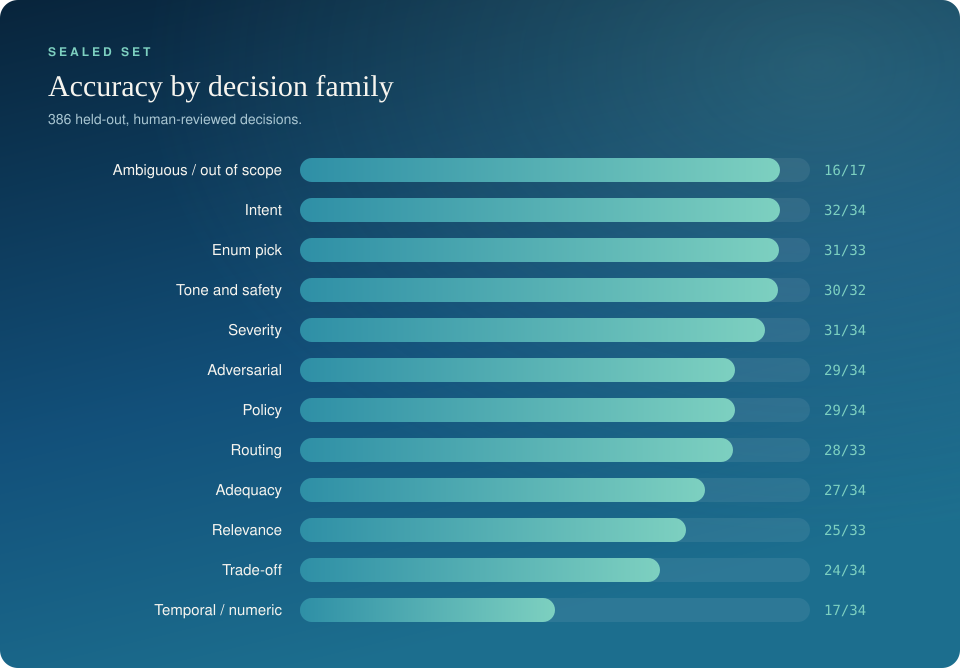
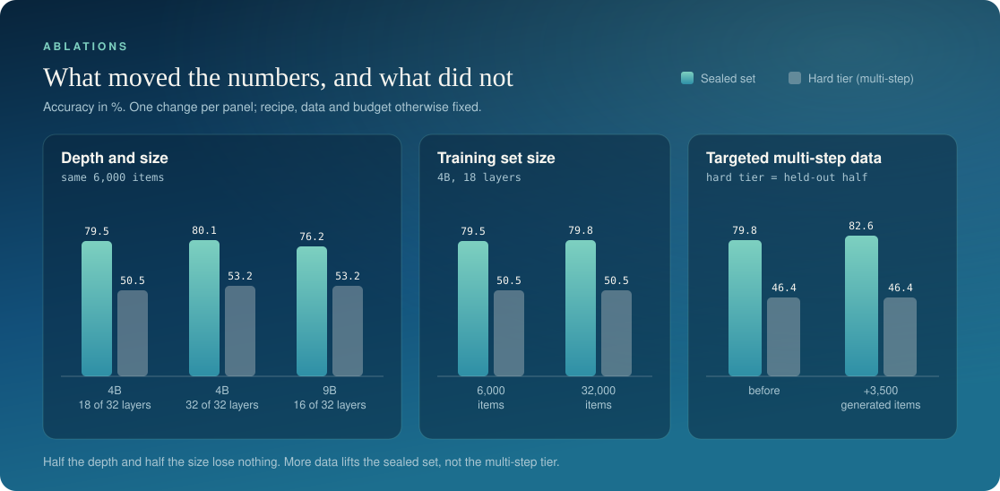
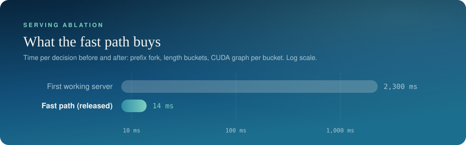

# Evaluation

The release-time numbers for Noma, how they were measured, and what we learned from the
experiments behind them. The [paper](https://doi.org/10.5281/zenodo.23186353) adds ablations with
confidence intervals, an option-order test and zero-shot results.

## Headline

| | Result |
|---|---|
| Latency, end to end (H100, JevBench client, 231 public tasks) | **16 ms median** |
| Latency, model only (H100) | 14 ms short states, 41 ms long states |
| Cost per 1,000 decisions | $0.023 by JevBench's method; $0.026 self-hosted on the measured H100 |
| JevBench easy | **48/48** (100%), ECE 0.011 |
| JevBench original | **71/72** (98.6%), ECE 0.084 |
| Sealed set, 12 families | **319/386** (82.6%), ECE 0.042 |
| JevBench, all public tasks | 176/231 (76.2%) |

The [paper](https://doi.org/10.5281/zenodo.23186353) re-evaluates the released weights item by item on a clean install and reports 15.1 ms median latency, 58/111 on the hard tier, 27/56 on the held-out hard items, and ECE of 0.043 on the sealed set and 0.071 on the original tier. The figures here are from the release-time runs; the two evaluation paths differ on a few items.

## How latency was measured

The released weights were served with `noma serve` on one NVIDIA H100 with the fast path on
(length buckets of 128 tokens, CUDA graph per bucket). JevBench's own runner then sent the
public tasks over HTTP, one at a time, from the same machine. This is the method JevBench
uses for hosted models, minus the internet round trip.

| Tier | Correct | Median | p95 |
|---|---|---|---|
| Easy (48) | 48 | 15.6 ms | |
| Original (72) | 71 | 15.5 ms | |
| Hard (111) | 57 | 34.9 ms | 106 ms |
| All public (231) | 176 | about 16 ms | |

Hard-tier states are long, which is why that tier is slower. Model-only time on other
hardware: 21 ms (short) and 80 ms (long) on an A100 40GB.

## JevBench, full results

<p align="center"></p>

| Model | Base | Easy | Standard | All public | Hard tier | Median latency | Cost per 1k |
|---|---|---|---|---|---|---|---|
| **Noma** | Qwen3.5-4B, 18 of 32 layers | **100%** | **98.6%** | 76.2% | 51.4% (46.4% held-out) | **16 ms** | **$0.023** |
| decider-4b v2 | 4B | 100% | 96.9% | 83.5% | 67.3% | 17 ms | $0.020 |
| Cygnet | frozen Gemma-4-12B | 100% | 96.9% | 87.9% | 75.5% | 35 ms | $0.037 |
| NInfer Flash-Next | large MoE | 100% | 99.0% | 89.6% | 77.3% | 79 ms | |
| JevOne | not disclosed | 100% | 96.9% | 89.6% | 75.0% | 87 ms | |
| Decision 2B | MiniCPM5-2B | 100% | | 75.3% | 58.2% | 189 ms | |
| decider-2b | 2B | | | 71.0% | 47.3% | 261 ms | |
| spark-s1-4b | Qwen3.5-4B | 100% | | 79.2% | 60.0% | 314 ms | |
| classifier.dev (fast) | Jev-based | 100% | 99.0% | 85.3% | 70.5% | 386 ms | |
| Nimble 9B | Qwen3.5-9B | 100% | 94.8% | 79.7% | 65.5% | 389 ms | $0.166 |
| OpenJev (thinking) | 26B MoE, generates reasoning | 100% | 100% | 88.7% | 78.2% | 463 ms | |
| kev 0.6B | 0.6B | 100% | 81.3% | 66.7% | 40.0% | 590 ms | |
| Jev 1.13.0 | not disclosed | 100% | 99.0% | 86.6% | 74.1% | 652 ms | $0.040 |
| Laya | ModernBERT 0.4B | | | 58.4% | 34.1% | 787 ms | |
| reflex 4B | 4B | 100% | | 79.2% | 63.2% | 1.8 s | |

Sorted by latency. Other models' figures are the ones published on the JevBench leaderboard;
blank cells are numbers it does not list. Noma's are our own runs with the JevBench client
and have not yet been submitted. Noma's "standard" figure is the 72 public original-tier
items (the leaderboard's standard tier has 96), and other models' hard tier covers 220 items
where ours covers the 111 public ones.

### Cost

<p align="center"></p>

| | Cost per 1,000 decisions | Basis |
|---|---|---|
| decider-4b v2 | $0.020 | JevBench estimate |
| **Noma** | **$0.023** | JevBench method, our token counts: about 750 input tokens per decision at $0.03 per million for the 4B class |
| Cygnet | $0.037 | JevBench estimate |
| Jev 1.13.0 | $0.040 | measured from TypeSafe's public price |
| Nimble 9B | $0.166 | JevBench estimate |

Noma's figure is an estimate by JevBench's method, as are the other open models'; Jev's is a
real price. Self-hosted, the measured setup (one H100 at $5.68 an hour, one serial stream,
about 60 decisions a second) costs **$0.026 per 1,000 decisions**. That is an upper bound for
that GPU: nothing is batched and the GPU waits between requests.

### Reading the hard tier

The hard tier is made of questions that need several chained steps: date arithmetic across
rules, long policies with amendments, multi-hop lookups, probability. Noma answers in one
forward pass with no scratchpad, and this is the tier where that design shows.

| Hard-tier family | Correct (public, 111) |
|---|---|
| Adversarial | 6/6 |
| Routing (hard) | 5/5 |
| Trap | 7/8 |
| Trade-off | 4/6 |
| Judge (hard) | 11/17 |
| Ambiguous | 4/7 |
| Multi-hop | 9/18 |
| Probability | 5/10 |
| Long policy | 4/19 |
| Temporal / numeric | 3/15 |

(Per-family counts are from the in-process evaluator, which scored 58/111; the HTTP run
scored 57/111. The one-item difference is numerical noise between the two paths.)

Two things to know about the hard-tier number:

1. **55 of the 111 public hard items were used as structure templates** for synthetic
   training data (the structure, never the text). The clean number is the one on the 56
   items that no generator or training run ever saw: **26/56 (46.4%)**, or 27/56 in the
   paper's per-item re-evaluation. We report both and
   treat the held-out figure as the real one.
2. The families split cleanly. Where the question is a judgement (adversarial, routing,
   trap, trade-off), Noma does well on the hard tier too. Where it is a calculation chain
   (temporal and numeric, long policy), it does not, and that is the part to send to a
   reasoning model.

In practice: confidence does not flag multi-step questions, so route them by question type
to a model that can reason step by step, and keep Noma on the decisions around it.

## Sealed set

386 scored decisions across 12 families, human reviewed, never used in training or by any
data generator. It was used to compare development runs and to choose the release. The set
is private.

<p align="center"></p>

| Family | Correct | Family | Correct |
|---|---|---|---|
| Ambiguous / out of scope | 16/17 | Policy | 29/34 |
| Intent | 32/34 | Routing | 28/33 |
| Enum pick | 31/33 | Adequacy | 27/34 |
| Tone and safety | 30/32 | Relevance | 25/33 |
| Severity | 31/34 | Trade-off | 24/34 |
| Adversarial | 29/34 | Temporal / numeric | 17/34 |

## Calibration

Expected calibration error (top label, lower is better):

| Set | ECE |
|---|---|
| JevBench easy | 0.011 |
| Sealed set | 0.042 |
| JevBench original | 0.084 |
| JevBench hard (public) | 0.186 |
| JevBench hard (held-out) | 0.263 |

The paper's per-item re-evaluation gives 0.043 for the sealed set, 0.071 for the original tier
and 0.282 for the held-out hard items.

On the kinds of decisions Noma is built for, stated confidence tracks accuracy closely.
On multi-step questions it is overconfident, which is one more reason to route those by
question type and not by confidence alone.

## Controlled experiments

Each row changes one thing and holds the recipe, data and budget fixed. These are single runs
from release time, and the size and data-volume rows used an earlier build of the training
data. The paper repeats depth with three seeds and adds ablations of the head, the ensemble,
the fact channel and the loss. Differences of a
point or two on these set sizes are inside the noise.

**Depth and size** (same LoRA recipe, same 6,000-item subset):

| Backbone | Layers used | Hard tier (public) | Sealed set |
|---|---|---|---|
| 4B | 18 of 32 | 50.5% | 79.5% |
| 4B | 32 of 32 | 53.2% | 80.1% |
| 9B | 16 of 32 | 53.2% | 76.2% |

Three seeds in the paper give 79.4% on the sealed set at both 18 and 32 layers.

<p align="center"></p>

**Training set size** (4B, 18 layers): 6,000 items give 79.5% sealed and 50.5% hard;
32,000 items give 79.8% and 50.5% (one seed each).

**Targeted multi-step data**: adding about 3,500 generated multi-step items moved the sealed
set from 79.8% to 82.6% and left the held-out hard items at 26/56.

**Serving**: the first working server took about 2.3 s per decision (an early development
figure); the released fast path
takes 14 ms of model time on an H100.

<p align="center"></p>

**Findings**

- **Mid-depth matches full depth for decisions.** Full depth is within noise of layer 18.
  A training step at 18 layers takes about two thirds of the time of one at 32; inference at
  32 layers was not timed.
- **4B scored no worse than 9B** under identical fine-tuning (one seed, earlier data build).
- **Data volume is not settled.** One seed on an earlier data build showed no gain from more
  data. The paper's runs give 79.4% at 6,000 items and 81.3% to 82.6% on the full set.
- **Targeted synthetic data does not transfer to held-out multi-step reasoning.** Adding
  about 3,500 generated multi-step items left the held-out hard items unchanged (26/56
  before and after) while the sealed set moved from 79.8% to 82.6%. Data, depth and size
  all fail to move that tier. We read this as a limit of single-pass decision models. The
  code is here; the training data is not, so exact repetition needs our data.

## External baseline

The untrained base model (Qwen3.5-4B-Base, all 32 layers), zero-shot, scoring each option
through its language-model head. One prompt, not tuned, nothing calibrated. Same items as above,
with the hard tier split into its exposed and held-out halves.

| Set | Items | Baseline | Noma | Difference (95% interval) |
|---|---|---|---|---|
| Sealed set | 386 | 70.7% | 82.6% | +11.9 [+7.5, +16.3] |
| JevBench easy | 48 | 100% | 100% | 0 |
| JevBench original | 72 | 70.8% | 98.6% | +27.8 [+18.1, +38.9] |
| JevBench hard, exposed | 55 | 52.7% | 56.4% | +3.6 [-9.1, +16.4] |
| JevBench hard, held-out | 56 | 57.1% | 48.2% | -8.9 [-21.4, +3.6] |

Training pays on single-pass decisions and not on multi-step ones: on the held-out hard items
the untrained full-depth model does at least as well as Noma (the difference is not
significant).

```bash
python -m noma.eval.lm_baseline --backbone Qwen/Qwen3.5-4B-Base --eval /path/to/tasks     --out baseline.json --dump baseline.jsonl
```

## Reproducing

```bash
# in-process accuracy and ECE on a folder of JevBench-format task files
python -m noma.eval.quick --ckpt /path/to/noma --eval /path/to/tasks --out results.json

# model-time latency, plain path against the fast path
python -m noma.serve.bench --ckpt /path/to/noma --tasks /path/to/tasks

# end to end: serve, then point the JevBench runner at http://127.0.0.1:8000
noma serve
```

The public JevBench tasks come from the JevBench repository. The sealed set is not released.
